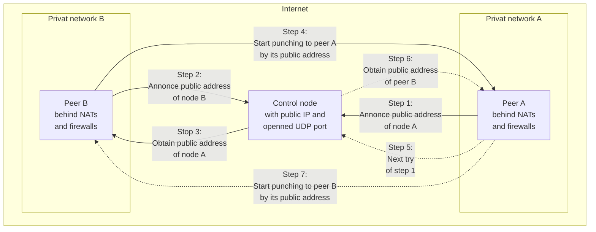
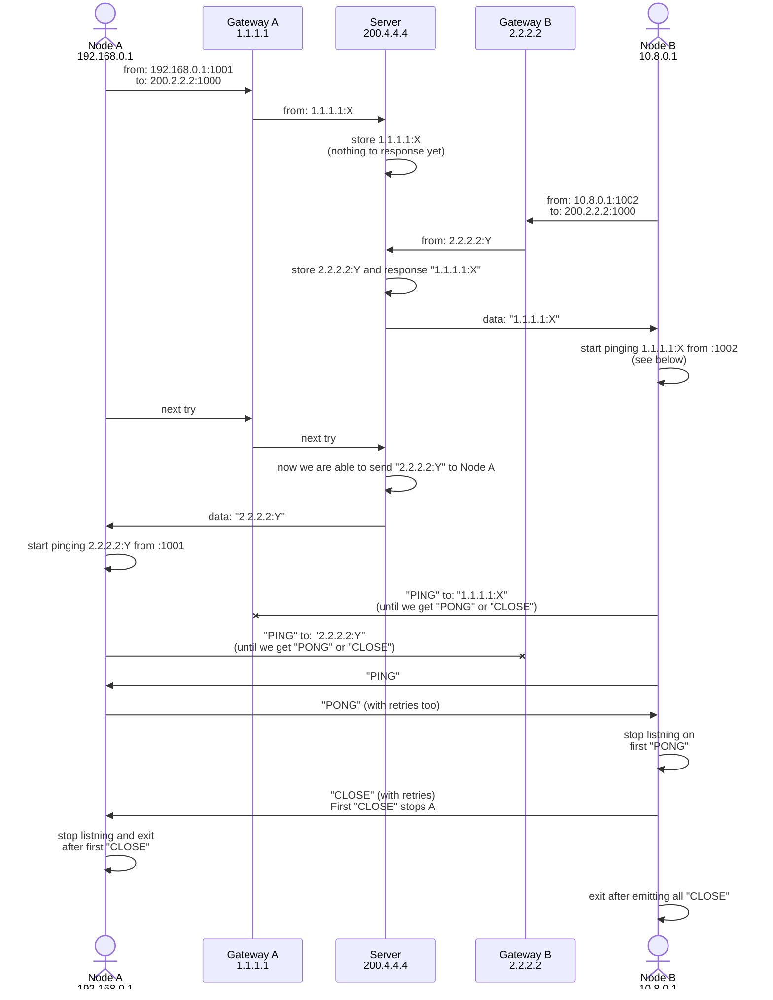

# Network hole punching tool

[](https://github.com/michurin/netpunch/actions/workflows/ci.yaml)

Netpunch is a tool to establishes network connections between nodes which are behind NATs and firewalls.

Netpunch has to be run on one *control* node with public IP address and on two *peer*-nodes from private networks.
Control node makes private peers able to know their public IPs and ports and setup VPN connection over UDP.

It is not an unheard solution. It is easy to find a lot of scripts, that are doing the same things.
However, the netpunch provides at least three advantages:

- You do not need root permissions to run it. The running with regular user permissions makes your system securer
- You do not need additional tools like `tcpdump`, `awk` etc, or additional libs
- All network interactions are protected by signature. So it is difficult to abuse your control node

## How does it work

Here is a slightly oversimplified flow. Boxes are nodes and network areas, arrows are UDP messages.



Each peer from private networks reaches public control node. Control node saves
public addresses of peers and makes them able to know public addresses of each other.
So peers from private networks become able to start punching towards each other.

## Quick start with OpenVPN

### Install binaries

```sh
go install -v github.com/michurin/netpunch/cmd/...@latest
```

For cross compilation look into [build.sh](build.sh) or just run `./build.sh -h`.

### Setup connection

You can find all instructions and hints in self-documented script [connection-example.sh](connection-example.sh).

Basically, you have to do three things:

- Start netpunch on control node (see instructions in [connection-example.sh](connection-example.sh)). You don't need to have root permissions to do that. However, you have to have open UDP port. If you don't, you are to be able to tune your firewall settings
- Start the script like `connection-example.sh` on peer A. Do not forget to generate `secret.key` file, as it shown in [connection-example.sh](connection-example.sh)
- Start slightly edited `connection-example.sh` on peer B. You need to change A to B and swap IP addresses.

## Development and contribution

### Key ideas

Let me share the key ideas of this project, before you start deep refactoring of it.

I regard this project as *library* `netpunchlib` and CLI tool, that uses this library.

I believe the library is to do what it has to do only. It means:

- It must be safe and free of goroutines leaking and stuff like that
- It must not produce any side effects, including logging. You still able to do things like logging, using middleware
- It must have compact interface
- It must provide full control and hide all internals

I'm thinking of CLI tool and `main.go` as an example of using this library. It shows clean example of

- logging (how to create your custom middleware)
- initialization
- shutting down

And I wonder to keep it pure and simple. For this reason, for example, I don't use
thing like [cobra](https://github.com/spf13/cobra).

If you wish to extremely improve CLI/UI/UX... if you want to extend functionality of CLI tool, to add more abilities...
won't you just consider creating your own project and using `netpunchlib` as a part of it? I, for my part,
will be happy to help you to adjust `netpunchlib` for your needs.

But on the contrary, if you find error in library, if you find leaks, misfeatures, inconvenient things,
if you find typos, if you want to improve scripts like `build.sh`, if you know how to make examples better,
your pull requests are welcome! However, if you are thinking about grand redevelopment, please open issues first.

### Local running

Terminal 1: control node

```sh
./netpunch -secret x -local :7777
```

Terminal 2: peer A

```sh
./netpunch -peer a -secret x -local :5000 -remote localhost:7777
```

Terminal 3: peer B

```sh
./netpunch -peer b -secret x -local :5001 -remote localhost:7777
```

You will get output on terminal 1 (control node):

```
2022/04/02 17:40:20.562777 [25399] [info] Start in control mode on :7777
2022/04/02 17:40:22.675092 [25399] [info] read: "a" <- 127.0.0.1:5000
2022/04/02 17:40:24.725055 [25399] [info] read: "b" <- 127.0.0.1:5001
2022/04/02 17:40:24.725102 [25399] [info] write: "i|a|127.0.0.1:5000" -> 127.0.0.1:5001
```

Terminal 2 (peer A):

```
2022/04/02 17:40:22.672392 [25400] [a] [info] Start in peer mode on :5000 to server at localhost:7777
2022/04/02 17:40:22.674964 [25400] [a] [info] write: "a" -> 127.0.0.1:7777
2022/04/02 17:40:24.725239 [25400] [a] [info] read: "x" <- 127.0.0.1:5001
2022/04/02 17:40:24.725291 [25400] [a] [info] write: "y" -> 127.0.0.1:5001
2022/04/02 17:40:24.725411 [25400] [a] [info] read: "z" <- 127.0.0.1:5001
2022/04/02 17:40:24.725451 [25400] [a] [info] close: ok
LADDR/LHOST/LPORT/RADDR/RHOST/RPORT: :5000 n/a 5000 127.0.0.1:5001 127.0.0.1 5001
```

Terminal 3 (peer B):

```
2022/04/02 17:40:24.724163 [25401] [b] [info] Start in peer mode on :5001 to server at localhost:7777
2022/04/02 17:40:24.725012 [25401] [b] [info] write: "b" -> 127.0.0.1:7777
2022/04/02 17:40:24.725135 [25401] [b] [info] read: "i|a|127.0.0.1:5000" <- 127.0.0.1:7777
2022/04/02 17:40:24.725174 [25401] [b] [info] write: "x" -> 127.0.0.1:5000
2022/04/02 17:40:24.725342 [25401] [b] [info] read: "y" <- 127.0.0.1:5000
2022/04/02 17:40:24.725378 [25401] [b] [info] write: "z" -> 127.0.0.1:5000
2022/04/02 17:40:24.775912 [25401] [b] [info] write: "z" -> 127.0.0.1:5000
2022/04/02 17:40:24.826117 [25401] [b] [info] write: "z" -> 127.0.0.1:5000
2022/04/02 17:40:24.876327 [25401] [b] [info] write: "z" -> 127.0.0.1:5000
2022/04/02 17:40:24.927088 [25401] [b] [info] write: "z" -> 127.0.0.1:5000
2022/04/02 17:40:24.927283 [25401] [b] [info] close: ok
LADDR/LHOST/LPORT/RADDR/RHOST/RPORT: :5001 n/a 5001 127.0.0.1:5000 127.0.0.1 5000
```

It is easy to understand this log messages. The first letter shows the type of message:
- `a` and `b` announce corresponding peer on control host
- `i` (with additional data) is an information on opposite peer from control node
- `x` is "ping" (can be seen as SYN)
- `y` is "pong" (can be seen as SYN+ACK)
- `z` is "close" (can be seen as ACK)

### Roadmap

- Docs
- More tests and code coverage

### Known issues

- The same private network: in some cases, netpunch won't work if both peers are sitting behind the same NAT
- MS Windows: nobody yet knows whether netpunch works on MS Windows. Please, let me know, if you do
- Not perfect diagnostics in case secrets mismatched: if secrets are mismatched it appears like a fake message with corresponding error. Slightly hackish and ugly
- Client-client protocol is extremely simple: according to the design you are able to link `a` and `b`, `c` and `d` and so on. However if `a` and `c` have the same address and port (by accident) you are able to connect `a` and `d`. Because client `d` can not distinguish `a` and `c`. It can confusing, but I don't think it gives grounds for ruining of simplicity of code and contract

### Internals



There are two phases:

- IP discover, using server with public IP (200.2.2.2 on diagram) and
- drilling, using PING-PONG-CLOSE communication

The PING-PONG-CLOSE approach is very similar to SYN-SYNACK-ACK. The
final phase, when we send all CLOSE packets, is similar to TIME-WAIT.

### Related links

#### Documentation

- [Peer-to-Peer Communication Across Network Address Translators](https://bford.info/pub/net/p2pnat/): fundamental work on P2P drilling
- [Setup OpenVPN](https://ubuntu.com/server/docs/service-openvpn)

#### Similar projects

- <https://github.com/yinheli/udppunch>
- <https://github.com/malcolmseyd/natpunch-go>
- <https://git.zx2c4.com/wireguard-tools/tree/contrib/nat-hole-punching/>
