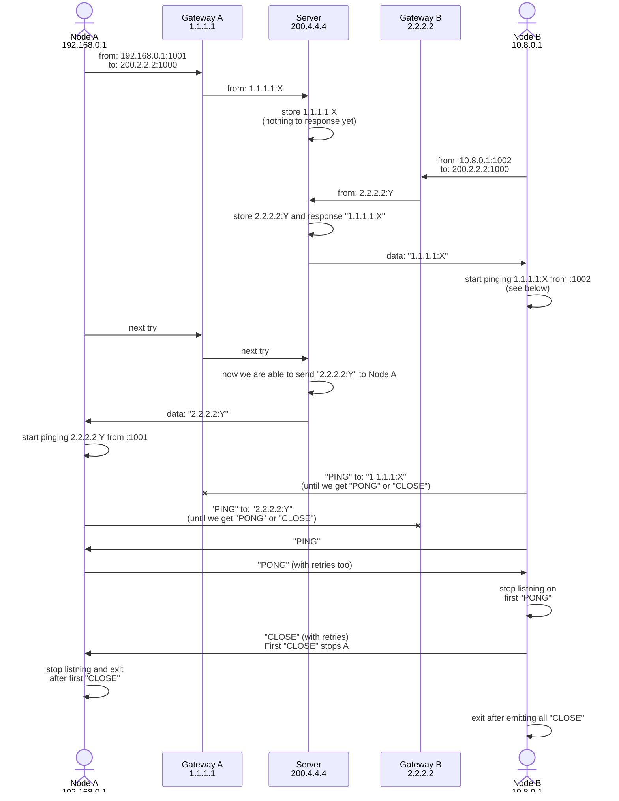

# Network hole punching tool

## Quick start with OpenVPN

### Prerequisites

#### Build binaries

TODO cross platform compilation

#### Setup server

Your server has to have public IP address and
at least on open UDP port. For example, iptables rule like that:

```
-A INPUT -p udp -m udp --dport 10001 -j ACCEPT
```

Run something like that on your server

```sh
./netpunch c SeCrEt :10001
```

- `c` — control mode (server)
- `SeCrEt` — shared secret
- `10001` — your open port

#### Setup clients

Generate shared secret for your VPN connection:

```sh
openvpn --genkey secret secret.key
```

Copy this secret to both clients

Setup `sudo` to be able to run `openvpn` without password:

```
your_user ALL=(root) NOPASSWD: /usr/bin/openvpn
```

#### Run clients

The example of script to establish connection:

```sh
#!/bin/bash

while :
do
    params=($(./netpunch a SeCrEt :10000 you-server.net:10001))

    test 'LADDR/LHOST/LPORT/RADDR/RHOST/RPORT:' = "${params[0]}" || exit 1

    lport=${params[3]}
    rhost=${params[5]}
    rport=${params[6]}

    echo "******* GOT LPORT=$lport RHOST=$rhost RPORT=$rport *******"

    sudo /usr/bin/openvpn --remote $rhost --rport $rport --lport $lport --proto udp \
                          --auth-nocache --secret secret.key --auth SHA256 --cipher AES-256-CBC \
                          --dev tun \
                          --ifconfig 192.168.2.1 192.168.2.2 \
                          --verb 3 \
                          --ping 10 --ping-exit 40
done
```

On the other node you have to change:

- mode (the first argument of `netpunch`): `a` to `b`
- OpenVPN `--ifconfig` option: swap IP addresses

## TODO / Roadmap

- Threat this staff as a library
  - Graceful shutdown
  - Docs
- Cleanup CLI interface

## Internals



There are two phases:

- IP discover, using server with public IP (200.2.2.2 on diagram) and
- drilling, using PING-PONG-CLOSE communication

The PING-PONG-CLOSE approach is very similar to SYN-SYNACK-ACK. The
final phase, when we send all CLOSE packets, is similar to TIME-WAIT.

## Related links

- [Peer-to-Peer Communication Across Network Address Translators](https://bford.info/pub/net/p2pnat/): fundamental work on P2P drilling
- [Setup OpenVPN](https://ubuntu.com/server/docs/service-openvpn)
