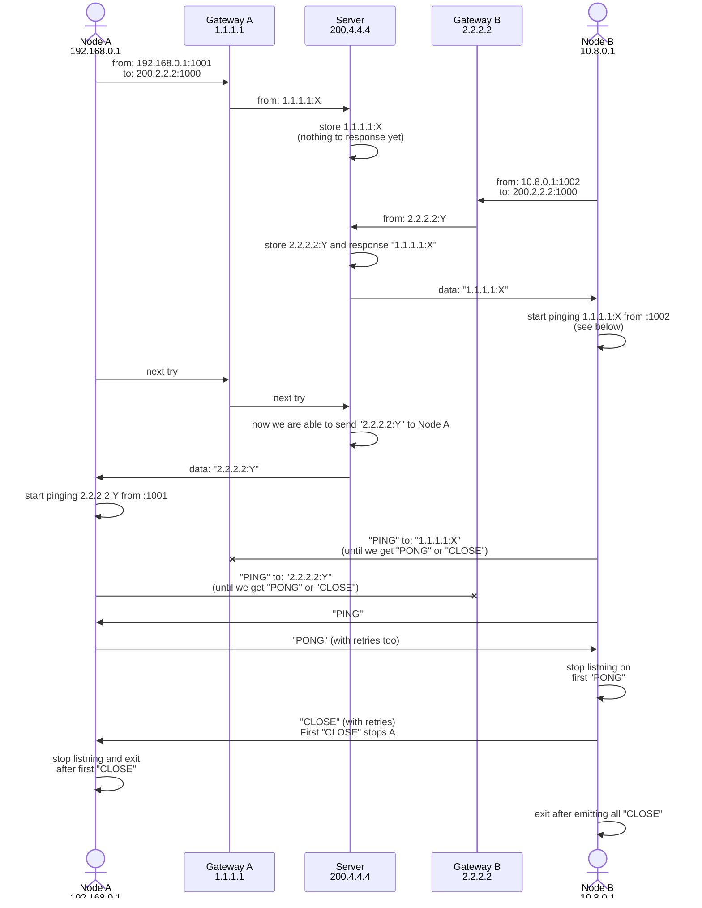

# Network hole punching tool

[](https://github.com/michurin/netpunch/actions/workflows/ci.yaml)

Netpunch is a tool to establishes network connections between nodes which are behind NATs and firewalls.

Netpunch has to be run on one *control* node with public IP address and on two *peer*-nodes from private networks.
Control node makes private peers able to know their public IPs and ports and setup VPN connection over UDP.

It is not an unheard solution. It is easy to find a lot of scripts, that are doing the same things.
However, the netpunch provides at least three advantages:

- You do not need root permissions to run it. The running with regular user permissions makes your system securer
- You do not need additional tools like `tcpdump`, `awk` etc, or additional libs
- All network interactions are protected by signature. So it is difficult to abuse your control node

## Quick start with OpenVPN

### Install binaries

```sh
go install -v github.com/michurin/netpunch/cmd/...@latest
```

For cross compilation look into [build.sh](build.sh) or just run `./build.sh -h`.

### Setup connection

You can find all instructions and hints in self-documented script [connection-example.sh](connection-example.sh).

Basically, you have to do three things:

- Start netpunch on control node (see instructions in [connection-example.sh](connection-example.sh)). You don't need to have root permissions to do that. However, you have to have open UDP port. If you don't, you are to be able to tune your firewall settings
- Start the script like `connection-example.sh` on peer A. Do not forget to generate `secret.key` file, as it shown in [connection-example.sh](connection-example.sh)
- Start slightly edited `connection-example.sh` on peer B. You need to change A to B and swap IP addresses.

## Development and contribution

### Key ideas

TODO

### Local running

Terminal 1: control node

```sh
./netpunch -secret x -local :7777
```

Terminal 2: peer A

```sh
./netpunch -peer a -secret x -local :5000 -remote localhost:7777
```

Terminal 3: peer B

```sh
./netpunch -peer b -secret x -local :5001 -remote localhost:7777
```

You will get output on terminal 1 (control node):

```
2022/04/02 17:40:20.562777 [25399] [info] Start in control mode on :7777
2022/04/02 17:40:22.675092 [25399] [info] read: "a" <- 127.0.0.1:5000
2022/04/02 17:40:24.725055 [25399] [info] read: "b" <- 127.0.0.1:5001
2022/04/02 17:40:24.725102 [25399] [info] write: "i|a|127.0.0.1:5000" -> 127.0.0.1:5001
```

Terminal 2 (peer A):

```
2022/04/02 17:40:22.672392 [25400] [a] [info] Start in peer mode on :5000 to server at localhost:7777
2022/04/02 17:40:22.674964 [25400] [a] [info] write: "a" -> 127.0.0.1:7777
2022/04/02 17:40:24.725239 [25400] [a] [info] read: "x" <- 127.0.0.1:5001
2022/04/02 17:40:24.725291 [25400] [a] [info] write: "y" -> 127.0.0.1:5001
2022/04/02 17:40:24.725411 [25400] [a] [info] read: "z" <- 127.0.0.1:5001
2022/04/02 17:40:24.725451 [25400] [a] [info] close: ok
LADDR/LHOST/LPORT/RADDR/RHOST/RPORT: :5000 n/a 5000 127.0.0.1:5001 127.0.0.1 5001
```

Terminal 3 (peer B):

```
2022/04/02 17:40:24.724163 [25401] [b] [info] Start in peer mode on :5001 to server at localhost:7777
2022/04/02 17:40:24.725012 [25401] [b] [info] write: "b" -> 127.0.0.1:7777
2022/04/02 17:40:24.725135 [25401] [b] [info] read: "i|a|127.0.0.1:5000" <- 127.0.0.1:7777
2022/04/02 17:40:24.725174 [25401] [b] [info] write: "x" -> 127.0.0.1:5000
2022/04/02 17:40:24.725342 [25401] [b] [info] read: "y" <- 127.0.0.1:5000
2022/04/02 17:40:24.725378 [25401] [b] [info] write: "z" -> 127.0.0.1:5000
2022/04/02 17:40:24.775912 [25401] [b] [info] write: "z" -> 127.0.0.1:5000
2022/04/02 17:40:24.826117 [25401] [b] [info] write: "z" -> 127.0.0.1:5000
2022/04/02 17:40:24.876327 [25401] [b] [info] write: "z" -> 127.0.0.1:5000
2022/04/02 17:40:24.927088 [25401] [b] [info] write: "z" -> 127.0.0.1:5000
2022/04/02 17:40:24.927283 [25401] [b] [info] close: ok
LADDR/LHOST/LPORT/RADDR/RHOST/RPORT: :5001 n/a 5001 127.0.0.1:5000 127.0.0.1 5000
```

### Roadmap

- Threat this staff as a library
  - Docs
  - Code coverage
- CI (setup github actions):
  - lint
  - test

### Known issues

- The same private network: in some cases, netpunch won't work if both peers are sitting behind the same NAT
- MS Windows: nobody yet knows whether netpunch works on MS Windows. Please, let me know, if you do
- Not perfect diagnostics in case secrets mismatched: if secrets are mismatched it appears like a fake message with corresponding error. Slightly hackish and ugly

### Internals



There are two phases:

- IP discover, using server with public IP (200.2.2.2 on diagram) and
- drilling, using PING-PONG-CLOSE communication

The PING-PONG-CLOSE approach is very similar to SYN-SYNACK-ACK. The
final phase, when we send all CLOSE packets, is similar to TIME-WAIT.

### Related links

- [Peer-to-Peer Communication Across Network Address Translators](https://bford.info/pub/net/p2pnat/): fundamental work on P2P drilling
- [Setup OpenVPN](https://ubuntu.com/server/docs/service-openvpn)
